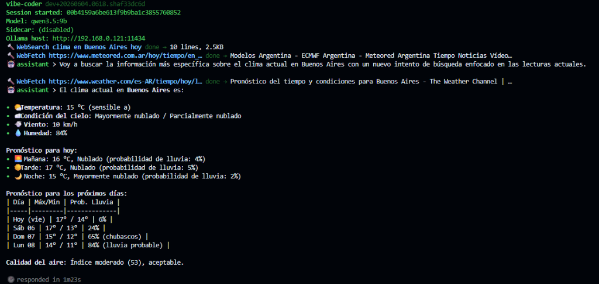

# vibe-coder

`vibe-coder` is a local-first coding agent for Ollama, built in Go.
It runs as a single static CLI binary and supports one-shot prompts, interactive REPL sessions, a rich tool system, session persistence with compaction, and optional RAG — all without leaving your machine.



## Features

### Core agent

- **One-shot prompts** (`-p`) and **interactive REPL** with streaming output.
- **Multi-turn agent loop** (up to 50 iterations, 2 retries) with tool observation feedback.
- **Empty-response recovery** — retries with escalating guidance when the model returns an empty reply.
- **XML fallback parser** — handles non-conformant LLMs that emit `<invoke>` blocks instead of native tool calls.
- **Auto-parallel detection** — recognizes 2-4 conjoined tasks in the user message and routes through `ParallelAgents`.

### Tools (exposed to the model)

- **File ops**: `Read`, `Write`, `Edit` (with inline unified-diff preview in the TUI).
- **Search**: `Glob`, `Grep` (multiline, context lines, output modes).
- **Shell**: `Bash` and `InteractiveBash` with dangerous-command blocklists and protected-path guards.
- **Web**: `WebFetch` and `WebSearch` (DuckDuckGo scrape) with SSRF protection.
- **Notebook**: `NotebookEdit` for `.ipynb` JSON round-trip.
- **Tasks**: `TodoWrite` (live to-do panel), `TaskStart`, `TaskList`, `TaskComplete`, `TaskCancel`.
- **Questions**: `AskUserQuestion` for interactive multi-choice prompts.
- **Orchestration**: `SubAgent` (bounded fan-out) and `ParallelAgents`.
- **All file-search tools** skip heavy directories (`.git`, `node_modules`, `vendor`, etc.) and respect cancellation.

### Session management

- **Atomic persistence** — append-only JSONL with temp-file + rename (`0o600`).
- **Project-aware indexing** — sessions are keyed by `sha256(cwd)[:16]` so `--resume` picks up where you left off per project.
- **Compaction** — triggered at 300 messages or 70 % of context window; a sidecar model summarizes the oldest messages while keeping the last 30 verbatim.
- **Token estimate** — maintained incrementally so compaction checks are O(1).

### Safety and permissions

- **Three permission tiers**: Safe (always allow), Ask (prompt), Network (always prompt).
- **`-y` mode** flips global allow except for always-confirm Bash patterns.
- **In-session memory** — `/yes` and `/no` toggle at runtime; decisions are remembered for the current session.
- **Persistent permissions** — saved to `<configDir>/permissions.json` (skips `Bash:allow`).
- **Dangerous-command blocklist** (`rm -rf /`, `> /dev/sda`, etc.) and **protected-path guard** (`/proc`, `/sys`, `~/.ssh/id_*`, `~/.aws/credentials`, etc.).
- **Environment scrubbing** — `Bash` runs with `safety.CleanEnv()` to strip secrets.
- **Plan mode** — `/plan` restricts writes to `<cwd>/.vibe-coder/plans/` until `/approve` returns to act mode.

### TUI

- **Two UI modes**: `plain` (default, line-based) and `rich` (Bubble Tea + Lipgloss with pinned status bar, themed markdown, and syntax highlighting). Select with `--ui rich`.
- **To-do panel** — `TodoWrite` renders a live Cursor-style task list with status glyphs.
- **Inline diff renderer** — `Edit` tool shows colored unified-diff (red/green/cyan) with 50-line truncation.
- **Type-ahead** — keystrokes pressed mid-generation are captured and prefilled into the next prompt.
- **Multiline input** — dedicated keybinding starts multi-line mode; plain Enter submits.
- **Terminal restoration** — signal handler ensures raw mode is never left behind on Ctrl+C or panic.

### Integrations

- **RAG** (optional, `-tags rag`) — SQLite-backed indexing and cosine-similarity retrieval. Build with `--rag-index`, query with `--rag`.
- **MCP** — stdio JSON-RPC client that discovers external tools and wraps them as `mcp_<server>_<name>`.
- **Skills auto-load** — searches three directories for skill markdown files (50 KiB cap, sanitized).
- **Git checkpoint + auto-test** — pre-Edit/Write stash; failing tests are re-injected as `[AUTO-TEST]` observations.
- **File watcher** — external file changes appear as `[System Note] N file change(s) detected` on the next iteration.

## Requirements

- Go `1.25+`
- A running Ollama instance for model-backed execution

## Install

### Pre-built binaries (recommended)

Download the archive for your OS and architecture from the
[GitHub Releases](https://github.com/jonathanhecl/vibe-coder/releases)
page, extract it, and move the binary to a directory in your `PATH`.

| OS | Architecture | Asset |
|----|--------------|-------|
| Windows | amd64 | `vibe-coder_<version>_windows_amd64.zip` |
| Linux | amd64 | `vibe-coder_<version>_linux_amd64.zip` |
| Linux | arm64 | `vibe-coder_<version>_linux_arm64.zip` |
| macOS | amd64 | `vibe-coder_<version>_darwin_amd64.zip` |
| macOS | arm64 | `vibe-coder_<version>_darwin_arm64.zip` |

Windows PowerShell example:

```powershell
# Download the latest release (replace <version> with the release tag, e.g. v0.1.0)
$version = "<version>"
$url = "https://github.com/jonathanhecl/vibe-coder/releases/download/${version}/vibe-coder_${version}_windows_amd64.zip"
Invoke-WebRequest -Uri $url -OutFile vibe-coder.zip
Expand-Archive -Path vibe-coder.zip -DestinationPath "$env:LOCALAPPDATA\Programs\vibe-coder" -Force
# Add to PATH, e.g. via Environment Variables settings or:
$env:Path += ";$env:LOCALAPPDATA\Programs\vibe-coder"
```

Linux / macOS example:

```bash
# Replace <version> and <os>_<arch> with the desired release and platform
version="<version>"
asset="vibe-coder_${version}_linux_amd64.zip"
curl -LO "https://github.com/jonathanhecl/vibe-coder/releases/download/${version}/${asset}"
unzip "${asset}"
sudo mv vibe-coder /usr/local/bin/
```

### Install with Go

If you have Go installed:

```bash
go install github.com/jonathanhecl/vibe-coder/cmd/vibe-coder@latest
```

Make sure your `GOBIN` or `GOPATH/bin` is in `PATH`.

### Install a development build

From a local clone, use the dev install scripts to build and install with the current Git metadata:

**Linux / macOS:**

```bash
./install-dev.sh
```

**Windows:**

```powershell
.\install-dev.ps1
```

### Build from source

```bash
go build -o vibe-coder ./cmd/vibe-coder
```

Windows:

```powershell
go build -o vibe-coder.exe ./cmd/vibe-coder
```

Verify the install:

```bash
vibe-coder --version
```

## Build

```bash
go build -o vibe-coder ./cmd/vibe-coder
```

Windows:

```powershell
go build -o vibe-coder.exe ./cmd/vibe-coder
```

Helper scripts:

```powershell
.\run.ps1        # build + run with forwarded flags
.\release.ps1    # cross-compile archives, create a Git tag, and publish a GitHub Release
```

```bash
./run.sh
```

The release workflow produces platform archives in `dist/`, then uploads them as assets to the GitHub Release for the requested tag.

## Quick Start

One-shot prompt:

```bash
./vibe-coder -p "Summarize this repository"
```

Interactive mode:

```bash
./vibe-coder
```

Use a specific model and host:

```bash
./vibe-coder --model llama3.1:8b --ollama-host http://127.0.0.1:11434
```

Send an initial prompt and keep chatting:

```bash
./vibe-coder -p "Refactor main.go" -i
```

## Model Configuration

Model settings are loaded with this precedence:

1. defaults
2. config file
3. environment variables
4. CLI flags (highest priority)

Default config file path:

- Windows: `%LOCALAPPDATA%\vibe-coder\vibe-coder.env`
- Linux/macOS: `~/.config/vibe-coder/vibe-coder.env`

You can override the config file path with:

- `VIBE_CODER_CONFIG=<path>`

Model keys and overrides:

- Config file key: `MODEL=<model-name>`
- Config file key: `UI=plain|rich`
- Config file key: `SIDECAR_MODEL=<model-name>`
- Environment: `VIBE_CODER_MODEL=<model-name>`
- Environment: `VIBE_CODER_UI=plain|rich`
- Environment: `VIBE_CODER_SIDECAR_MODEL=<model-name>`
- CLI: `--ui plain|rich`
- CLI: `--model <model-name>` (or `-m <model-name>`)

If no model is set, `vibe-coder` auto-selects one based on detected RAM tier.

> **Recommended model**: `ornith:9b` works very well with Ollama for coding and multi-turn tool conversations in `vibe-coder`.
>
> ```bash
> ./vibe-coder --model ornith:9b --ollama-host http://127.0.0.1:11434
> ```

### What is the sidecar model for?

`MODEL` is the conversational/coding model that answers every prompt. The
**sidecar** is a smaller, faster model `vibe-coder` uses internally for
short, high-leverage tasks the main model would either bloat the context
with or answer too slowly. All sidecar calls are guarded by a worker
semaphore, request deduplication (`singleflight`) and a small LRU cache,
so even on a single local Ollama instance you never see N parallel
requests piling up.

The sidecar is invoked in three places today:

1. **Session compaction** — when the session has more than 300 messages
   or the incremental token estimate exceeds 70% of `ContextWindow`,
   `Session.Compact()` sends the oldest messages to the sidecar with a
   "Summarize the conversation concisely" prompt and replaces them with
   the summary. The last 30 messages are kept verbatim.
2. **Tool-output condensation** — when a tool (typically `Read`, `Bash`,
   `Grep`) returns more than ~6 KB, the output is sent to the sidecar
   with a strict "produce 4-10 bullets, preserve paths/symbols/errors,
   no prose" system prompt. The condensed bullets replace the raw bytes
   in the model's context.
3. **Path disambiguation** — when the agent rescues a relative path
   (e.g. `Read("config.go")`) and finds **multiple** known absolute
   candidates, the sidecar picks one based on the user's current goal.

Pick a sidecar that is **fast and cheap** (e.g. `llama3.2:3b`,
`qwen3.5:4b`, `phi3:mini`). Leave it empty to disable all three
behaviours: compaction will truncate to a static "Earlier conversation
truncated…" note, large tool outputs will be inserted verbatim into the
context, and ambiguous paths will not be rescued.

### Remote Ollama for vibe-coder only

If Ollama runs on another machine in your network, you can configure `vibe-coder` and persist
those settings in one command, without changing global environment variables:

```powershell
.\vibe-coder.exe -model "qwen3.5:9b" -sidecar "qwen3.5:4b" -ollama-host "http://192.168.1.50:11434" -save
```

What this does:

- Applies model, sidecar model, and host for the current run.
- Writes `MODEL`, `SIDECAR_MODEL`, and `OLLAMA_HOST` to
  `%LOCALAPPDATA%\vibe-coder\vibe-coder.env`.
- Keeps the change scoped to `vibe-coder` only (no `setx` needed).

Next runs can simply use:

```powershell
.\vibe-coder.exe
```

If you use PowerShell and want to run from source with the same flags:

```powershell
.\run.ps1 -model "qwen3.5:9b" -sidecar "qwen3.5:4b" -ollama-host "http://192.168.1.50:11434" -save
```

## CLI Flags

- `--version` — print version and exit
- `--help` — show usage and exit
- `--ui <mode>` — UI mode (`plain` or `rich`)
- `-p, --prompt <text>` — one-shot prompt
- `-i, --interactive` — interactive mode (combine with `-p` to send an initial prompt and keep chatting)
- `-m, --model <name>` — model name
- `--sidecar <name>` — sidecar model name
- `--no-sidecar` — disable sidecar for this session only; with `--save`, persists `SIDECAR_DISABLED=true`
- `-y, --yes` — enable yes mode (auto-approve non-dangerous tools)
- `--debug` — enable debug logs
- `--resume` — resume the last session for this project
- `--session-id <id>` — resume a specific session
- `--list-sessions` — list known sessions
- `--ollama-host <url>` — Ollama base URL
- `--max-tokens <n>` — max generated tokens
- `--temperature <f>` — sampling temperature
- `--context-window <n>` — model context window
- `--no-think` — disable Ollama native thinking (faster replies)
- `--hide-think` — hide Ollama thinking blocks in CLI output
- `--rag` — enable RAG mode
- `--rag-mode <type>` — RAG mode type
- `--rag-path <path>` — RAG database path
- `--rag-topk <n>` — RAG top-k chunks
- `--rag-model <name>` — RAG embedding model
- `--rag-index <path>` — build/index RAG path and exit
- `--save` — persist `MODEL`, `SIDECAR_MODEL`, `OLLAMA_HOST`, and `HIDE_THINK` into `vibe-coder.env`

## MCP & Skills Management CLI

`vibe-coder` provides dedicated CLI subcommands to list, add, and remove MCP servers and custom skills.

### MCP (Model Context Protocol)

Manage stdio-based JSON-RPC MCP servers in global or project-local configurations.

* **List configured servers**:
  ```bash
  vibe-coder mcp list
  ```
* **Add or update an MCP server**:
  ```bash
  # Adds a local server under .vibe-coder/mcp.json (default)
  vibe-coder mcp add --env API_KEY=secret weather-server node path/to/server.js
  
  # Adds a global server under configDir/mcp.json
  vibe-coder mcp add --global --env DEBUG=true logger-server python path/to/logger.py
  ```
* **Remove a server**:
  ```bash
  vibe-coder mcp remove weather-server
  vibe-coder mcp remove --global logger-server
  ```

### Skills

Manage instruction-based custom agent skills.

* **List loaded skills**:
  ```bash
  vibe-coder skill list
  ```
* **Add a new skill**:
  ```bash
  # Adds a local skill under .vibe-coder/skills/my-skill.md (default)
  vibe-coder skill add my-skill path/to/source.md

  # Adds a global skill under configDir/skills/my-skill.md
  vibe-coder skill add --global my-global-skill path/to/source.md
  ```

## Slash Commands

Slash commands are entered at the `>` prompt during an interactive session.

### Session

- `/save` — persist the current session to disk
- `/clear` — save and start a brand new session
- `/sessions` — list saved sessions (`*` = current project)
- `/session <id>` — resume a specific session quickly
- `/sessions delete <id>` — delete a specific session
- `/sessions delete --all` — delete every saved session
- `/resume` — resume the last session for this project path
- `/resume <id>` — resume a specific session by id (or unique prefix)
- `/compact` — force a sidecar-summarized compaction
- `/tokens` — show token usage vs the context window
- `/status` — show model, cwd, session and sidecar status

### Model

- `/model` — show the active model
- `/model <name>` — switch the active model for this run
- `/sidecar on|off` — toggle the sidecar for this session
- `/sidecar perm-on|perm-off` — persist sidecar state to `vibe-coder.env`
- `/sidecar status` — show current sidecar state
- `/hide-think` — hide model thinking blocks in CLI output
- `/show-think` — show model thinking blocks in CLI output (default)

### Mode

- `/yes` — auto-approve subsequent permission prompts
- `/no` — require manual approval (default)
- `/plan` — enter plan mode (writes restricted to `.vibe-coder/plans/`)
- `/plan <goal>` — enter plan mode and immediately start planning that goal
- `/code` — exit plan mode and return to coding mode
- `/approve` — exit plan mode and resume act mode in the same chat

### Git

- `/commit` — stage + commit current changes (LLM-suggested message)

### Misc

- `/help` — show the command reference
- `/exit`, `/quit`, `/q` — save and exit

## Built-in Tool Notes

The agent exposes tools to the model through the system prompt. Users normally
do not call these directly, but their behavior affects speed and context usage:

- `Read` accepts `start_line`, `end_line`, `offset`, `limit`, and `max_bytes`
  for partial file reads. Without those parameters it reads the full file
  with line numbers.
- `Write` creates or overwrites a file; dangerous paths and protected
  directories are blocked.
- `Edit` applies a replacement; the TUI renders a colored unified-diff preview.
- `Glob` accepts `head_limit` to bound large file listings.
- `Grep` accepts `head_limit`, `offset`, `glob`, `output_mode`, `multiline`,
  `-i`, `-A`, `-B`, and `-C`.
- `Bash` runs a shell command with cleaned environment and dangerous-pattern
  guards. `InteractiveBash` starts a persistent terminal session for
  multi-step CLI workflows.
- `WebFetch` and `WebSearch` fetch web content with SSRF protection.
- `NotebookEdit` edits `.ipynb` cells by JSON round-trip.
- `TodoWrite` maintains a live task list that the TUI renders as a panel.
- `AskUserQuestion` pauses the agent to ask the user a multi-choice question.
- `SubAgent` and `ParallelAgents` spawn child agents with bounded fan-out.
- `Glob` and `Grep` skip heavy directories such as `.git`, `node_modules`,
  `vendor`, `dist`, `build`, `target`, and `.vibe-coder`.
- `Read`, `Glob`, and `Grep` respect cancellation, so ESC/Ctrl-C can stop
  long file operations cleanly.

## RAG Usage

Build an index:

```bash
./vibe-coder --rag-index ./somewhere
```

Run with RAG enabled:

```bash
./vibe-coder --rag -p "Find where permissions are enforced"
```

RAG is an optional build feature. To compile with RAG support:

```bash
go build -tags rag -o vibe-coder ./cmd/vibe-coder
```

## Development

### Running tests

```bash
# Default tests (no RAG)
go test ./...

# With RAG support
go test -tags rag ./...
```

### Helper scripts

| Script | Purpose |
|--------|---------|
| `build.ps1` / `build.sh` | Dev build with timestamp + short Git hash |
| `run.ps1` / `run.sh` | Build + run with forwarded CLI flags |
| `release.ps1` / `release.sh` | Cross-compile for linux/amd64, linux/arm64, darwin/amd64, darwin/arm64, windows/amd64; produces archives + `checksums.txt` |

### Project layout

```
cmd/vibe-coder/          # Entry point and CLI wiring
internal/
  agent/                 # Agent loop, chat orchestration, tool execution
  config/                # Config loader (defaults < file < env < CLI)
  git/                   # Git checkpoint + auto-test
  mcp/                   # MCP stdio JSON-RPC client
  ollama/                # Ollama HTTP client (streaming NDJSON)
  onboarding/            # First-run interactive setup
  permissions/           # Permission tiers + in-session memory + persistence
  prompt/                # System prompt builder + instruction-file walk
  rag/                   # Optional SQLite RAG engine (build tag: rag)
  safety/                # Dangerous-command blocklist + env scrub
  session/               # Session persistence, compaction, project index
  sidecar/               # Sidecar model worker pool
  skills/                # Skill markdown auto-load
  slash/                 # Slash command dispatcher
  terminal/              # Interactive Bash session manager
  tools/                 # Built-in tool registry + implementations
  tui/                   # Plain and rich UI implementations
  version/               # Build-time version string
  watcher/               # File-change poller
```

## Architecture Overview

`vibe-coder` is structured as a thin `cmd/` layer over focused `internal/`
packages:

1. **Config** (`internal/config`) loads settings with the precedence
   `defaults < vibe-coder.env < environment < CLI flags`.
2. **Agent** (`internal/agent`) runs the multi-turn loop: chat once,
   parse tool calls, execute, feed results back, repeat. Capped at 50
   iterations with 2 retries.
3. **Session** (`internal/session`) stores the transcript as append-only
   JSONL. It compacts automatically via the sidecar when the token estimate
   exceeds 70 % of the context window or message count exceeds 300.
4. **Tools** (`internal/tools`) register themselves into a central
   registry. The agent exposes their schemas to the model through the system
   prompt. MCP tools are discovered at startup and injected dynamically.
5. **TUI** (`internal/tui`) abstracts rendering behind a `UI` interface.
   `PlainUI` is the default; `RichUI` (Bubble Tea + Lipgloss) is selected
   with `--ui rich`.
6. **Ollama client** (`internal/ollama`) handles streaming NDJSON chat,
   model tags, version, and pull progress.

## License

MIT
