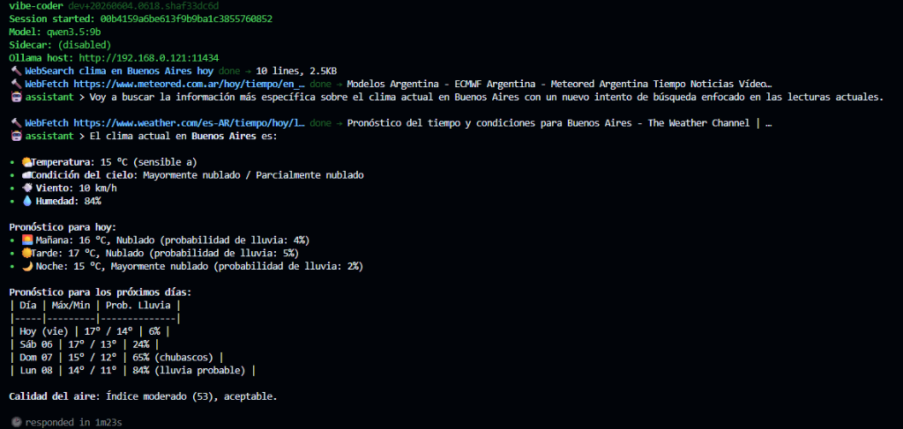

<p align="center">
  
</p>

<h1 align="center">vibe-coder</h1>

<p align="center">
  <strong>A local-first coding agent for <a href="https://ollama.com">Ollama</a>, written in Go.</strong>
</p>

<p align="center">
  Ships as a single static binary named <code>vibe</code> — one-shot prompts, an interactive REPL,
  a rich tool system, session persistence with compaction, and optional RAG, all without leaving your machine.
</p>

<p align="center">
  <a href="https://github.com/jonathanhecl/vibe-coder/releases/latest"></a>
  <a href="https://github.com/jonathanhecl/vibe-coder/actions/workflows/ci.yml"></a>
  
  
  <a href="LICENSE"></a>
  
</p>

<p align="center">
  
</p>

## Contents

- [Features](#features)
- [Requirements](#requirements)
- [Install](#install)
- [Quick Start](#quick-start)
- [Model Configuration](#model-configuration)
- [CLI Flags](#cli-flags)
- [MCP & Skills Management CLI](#mcp--skills-management-cli)
- [Slash Commands](#slash-commands)
- [Vision](#vision)
- [RAG Usage](#rag-usage)
- [Development](#development)
- [Architecture Overview](#architecture-overview)
- [Contributing](#contributing)
- [Security](#security)
- [License](#license)

## Features

### Core agent

- **One-shot prompts** (`-p`) and **interactive REPL** with streaming output.
- **Multi-turn agent loop** (up to 50 iterations, 2 retries) with tool observation feedback.
- **Native tool calling** — registry schemas are sent as Ollama `tools`; capability is detected from `/api/tags`, with a `/api/show` probe when tag metadata is missing (`Tools: native|xml|auto` in `/status`), plus per-session 400 fallback and caching. Streamed calls are accumulated across chunks, and native turns replay structured history (`assistant.tool_calls` + role `tool` results) instead of text envelopes.
- **Batched tool calls** — up to 5 sequential calls per turn (native or `<invoke>` XML fallback) for independent calls.
- **Empty-response recovery** — retries with escalating guidance when the model returns an empty reply.
- **XML fallback parser** — kept for models without native function calling; native calls always win when present.
- **Verify-after-write** — after every `Write`/`Edit`, the agent Reads the edited region and runs the relevant check before moving on.
- **Autonomous missions (agent-managed)** — for work that outlasts a single reply, the agent can call `MissionStart` to declare a mission. The runtime then keeps starting turns for it, with **no turn limit**, until the agent itself calls `MissionComplete` (goal done) or `MissionBlocked` (needs the user). The mission is task-agnostic and needs no user command to activate.
- **Durable work state** — the mission, live TODO checklist, and task store are persisted in a session sidecar and restored on `--resume`/`/session`, so a crash or restart never loses what is done and what remains. A compact progress summary derived from that state is injected into the system prompt every turn, so compaction can never make the agent forget what is done or what remains.
- **Auditable run log** — each autonomous turn appends one redacted JSONL record (turn, mission status, checklist counts, tools used, error) to `<state dir>/runs/<session>.jsonl`, so a multi-hour run can be reviewed after the fact.

### Autonomous missions

Some work does not fit in one reply: a batch of hundreds of items, a migration,
or an iterative generate-and-check loop that runs for hours. For those, the
agent itself decides to run a **mission**:

1. It calls `MissionStart` with the user's goal and opens a `TodoWrite`
   checklist.
2. The runtime keeps starting new turns for it (`[mission] continuing
   autonomously`) after each per-turn iteration cap — with **no turn limit**.
3. The agent ends the mission itself: `MissionComplete` with a summary when the
   goal is done, or `MissionBlocked` with a reason when it needs the user.

There is no user command to enable this and no arbitrary turn budget; the agent
owns the lifecycle. While a mission is active the run is **unattended**: Ask and
Network tools are auto-approved so nothing blocks waiting for the user, while
mandatory dangerous-command confirmations are denied (never prompted) so the
agent gets a denial and can adapt or call `MissionBlocked`. Empty responses are
retried automatically and, if they persist, or if several turns run no tools at
all, the mission is paused instead of spinning. The mission, checklist, and tasks
are written to disk after every turn, so `--resume` continues an interrupted
mission exactly where it stopped and tells you a mission is waiting. `/status`
shows the current mission, and every turn is appended to the redacted run log at
`<state dir>/runs/<session>.jsonl` for auditing.

### Tools (exposed to the model)

- **File ops**: `Read`, `Write`, `Edit` (with inline unified-diff preview in the TUI).
- **Search**: `Glob`, `Grep` (multiline, context lines, output modes).
- **Shell**: `Bash` and `InteractiveBash` with dangerous-command blocklists and protected-path guards.
- **Web**: `WebFetch` and `WebSearch` (DuckDuckGo scrape) with SSRF protection: private hosts are rejected up front, every redirect target is re-validated (max 5 hops), connections are pinned to publicly resolved addresses (DNS-rebinding guard), and requests respect cancellation.
- **HTTP**: `HTTPRequest` — a generic `method`/`url`/`headers`/`body` request tool for REST/JSON APIs, including local services (it allows localhost, unlike `WebFetch`). Network-tier, domain-agnostic, and the reliable alternative to shelling out to `curl`.
- **Notebook**: `NotebookEdit` for `.ipynb` JSON round-trip.
- **Tasks**: `TodoWrite` (live to-do panel), `TaskStart`, `TaskList`, `TaskComplete`, `TaskCancel`.
- **Missions**: `MissionStart` (declare a long-running goal and hand the runtime control), `MissionComplete` (goal done), `MissionBlocked` (needs the user).
- **Questions**: `AskUserQuestion` for interactive multi-choice prompts.
- **Orchestration**: `SubAgent` (bounded ReAct loop over Read/Glob/Grep, opt-in writes) and `ParallelAgents` (explicit model calls only).
- **Git**: `GitStatus`, `GitDiff`, `GitUndo` (restore the latest vibe-coder checkpoint).
- **All file-search tools** skip heavy directories (`.git`, `node_modules`, `vendor`, etc.) and respect cancellation.

### Session management

- **Atomic persistence** — append-only JSONL with temp-file + rename (`0o600`).
- **Project-aware indexing & auto-resume** — sessions are keyed by `sha256(cwd)[:16]` so running `vibe` automatically resumes where you left off in that directory (tagged as `(resumed)` in the banner). Use `/new` or `-n`/`--new` to start fresh.
- **Temporal (ephemeral) sessions** — run with `-t`, `--temporal`, or `--temp`. Chat transcript and session indexes are completely discarded on exit, while files and code modifications made by the agent remain intact. Running `/save` within a temporal session promotes it to permanent.
- **Compaction** — triggered at 300 messages or 70 % of context window; a sidecar model summarizes the oldest messages while keeping the last 30 verbatim.
- **Token estimate** — maintained incrementally so compaction checks are O(1).

### Safety and permissions

- **Three permission tiers**: Safe (allow unless denied), Ask, and Network (prompt unless approved by a remembered rule or `-y`). Persistent denials apply to safe tools too.
- **`-y` mode** enables auto-approval except for mandatory confirmation patterns in `Bash` and `InteractiveBash`. Remembered approvals cannot bypass those confirmations.
- **In-session memory** — `/yes` and `/no` toggle at runtime; decisions are remembered for the current session.
- **Persistent permissions** — saved as `TOOL_PERMISSIONS` in `vibe-coder.env` (skips `Bash:allow`; legacy `permissions.json` is migrated).
- **Dangerous-command blocklist** (`rm -rf /`, `> /dev/sda`, etc.) and **protected-path guard** (`/proc`, `/sys`, `~/.ssh/id_*`, `~/.aws/credentials`, etc.).
- **Environment scrubbing** — shell tools and auto-tests run with `safety.CleanEnv()` to strip secrets.
- **Plan mode** — `/plan` permits read-only tools and session task management; `Write`/`Edit` are restricted to `<cwd>/.vibe-coder/plans/`, without symlink paths. Shell commands, auto-tests, `NotebookEdit`, `GitUndo`, and unknown/MCP tool effects are blocked until act mode resumes.
- **Review mode** — `/review <prompt>` permits read-only tools and session task management, with no file mutations or shell commands. Unknown/MCP tool effects are blocked by default.
- **Delegated permissions** — sub-agents inherit the parent's tool availability, permission checks, and active mode. `allow_writes=true` only requests access; it does not grant approval. Child tool execution is serialized, including permission prompts, checkpoints, and auto-tests.

### TUI

- **Two UI modes**: `plain` (default, line-based) and `rich` (Bubble Tea + Lipgloss with pinned status bar, themed markdown, and syntax highlighting). Select with `--ui rich`.
- **To-do panel** — `TodoWrite` renders a live Cursor-style task list with status glyphs.
- **Inline diff renderer** — `Edit` tool shows colored unified-diff (red/green/cyan) with 50-line truncation.
- **Type-ahead** — keystrokes pressed mid-generation are captured and prefilled into the next prompt.
- **Multiline input** — dedicated keybinding starts multi-line mode; plain Enter submits.
- **Terminal restoration** — signal handler ensures raw mode is never left behind on Ctrl+C, ESC, or panic.

### Integrations

- **RAG** (optional, `-tags rag`) — SQLite-backed indexing and cosine-similarity retrieval. Build with `--rag-index`, query with `--rag`.
- **MCP** — stdio JSON-RPC client that discovers external tools and wraps them as `mcp_<server>_<name>`.
- **Skills auto-load** — searches three directories for skill markdown files (50 KiB cap, sanitized).
- **File checkpoint + auto-test** — pre-Edit/Write copies leave the working tree, index, and stashes untouched. A successful changed file becomes a completed checkpoint; failed or unchanged edits do not replace usable undo history. Related tests request shell execution permission, and failures or denied execution are re-injected as `[AUTO-TEST]` observations.
- **File watcher** — external file changes appear as `[System Note] N file change(s) detected` on the next iteration.

## Requirements

- Go `1.26+` (see `go.mod`)
- A running Ollama instance for model-backed execution

## Install

### Pre-built binaries (recommended)

Download the archive for your OS and architecture from the
[GitHub Releases](https://github.com/jonathanhecl/vibe-coder/releases)
page, extract it, and move the binary to a directory in your `PATH`.

| OS | Architecture | Asset |
|----|--------------|-------|
| Windows | amd64 | `vibe_<version>_windows_amd64.zip` |
| Linux | amd64 | `vibe_<version>_linux_amd64.zip` |
| Linux | arm64 | `vibe_<version>_linux_arm64.zip` |
| macOS | amd64 | `vibe_<version>_darwin_amd64.zip` |
| macOS | arm64 | `vibe_<version>_darwin_arm64.zip` |

Windows PowerShell example:

```powershell
# Download the latest release (replace <version> with the release tag, e.g. v0.1.0)
$version = "<version>"
$url = "https://github.com/jonathanhecl/vibe-coder/releases/download/${version}/vibe_${version}_windows_amd64.zip"
Invoke-WebRequest -Uri $url -OutFile vibe.zip
Expand-Archive -Path vibe.zip -DestinationPath "$env:LOCALAPPDATA\Programs\vibe" -Force
# Add to PATH, e.g. via Environment Variables settings or:
$env:Path += ";$env:LOCALAPPDATA\Programs\vibe"
```

Linux / macOS example:

```bash
# Replace <version> and <os>_<arch> with the desired release and platform
version="<version>"
asset="vibe_${version}_linux_amd64.zip"
curl -LO "https://github.com/jonathanhecl/vibe-coder/releases/download/${version}/${asset}"
unzip "${asset}"
sudo mv vibe /usr/local/bin/
```

### Install with Go

If you have Go installed:

```bash
go install github.com/jonathanhecl/vibe-coder/cmd/vibe@latest
```

Make sure your `GOBIN` or `GOPATH/bin` is in `PATH`.

### Install a development build

From a local clone, use the dev install scripts to build and install with the current Git metadata:

**Linux / macOS:**

```bash
./install-dev.sh
```

**Windows:**

```powershell
.\install-dev.ps1
```

### Build from source

```bash
go build -o vibe ./cmd/vibe
```

Windows:

```powershell
go build -o vibe.exe ./cmd/vibe
```

Verify the install:

```bash
vibe --version
```

## Build

```bash
go build -o vibe ./cmd/vibe
```

Windows:

```powershell
go build -o vibe.exe ./cmd/vibe
```

Helper scripts:

```bash
./run.sh          # build + run with forwarded flags
./release.sh      # cross-compile archives, create a Git tag, and publish a GitHub Release
```

```powershell
.\run.ps1
.\release.ps1
```

On Linux/macOS, publish a release with:

```bash
GITHUB_TOKEN=<token> ./release.sh v1.0.5
```

`release.sh` runs the test suite (unless `--skip-tests`), builds all platform
archives into `dist/`, writes `dist/checksums.txt`, then creates the Git tag and
the GitHub Release and uploads the assets. `--yes` skips the confirmation prompt
for non-interactive use. It needs a token with `repo` scope in `GITHUB_TOKEN`
(or `GH_TOKEN`, or an authenticated `gh` CLI); a zip tool (`zip`, 7z, bsdtar, or
python3) is used for packaging.

The release workflow produces platform archives in `dist/`, then uploads them as assets to the GitHub Release for the requested tag.

## Quick Start

One-shot prompt:

```bash
./vibe -p "Summarize this repository"
```

Interactive mode:

```bash
./vibe
```

Use a specific model and host:

```bash
./vibe --model llama3.1:8b --ollama-host http://127.0.0.1:11434
```

Send an initial prompt and keep chatting:

```bash
./vibe -p "Refactor main.go" -i
```

## Model Configuration

Model settings are loaded with this precedence:

1. defaults
2. config file
3. environment variables
4. CLI flags (highest priority)

Default config file path:

- Windows: `%LOCALAPPDATA%\vibe-coder\vibe-coder.env`
- Linux/macOS: `~/.config/vibe-coder/vibe-coder.env`

You can override the config file path with:

- `VIBE_CODER_CONFIG=<path>`

Model keys and overrides:

- Config file key: `MODEL=<model-name>`
- Config file key: `UI=plain|rich`
- Config file key: `SIDECAR_MODEL=<model-name>`
- Config file key: `JEVSTYLE_MODEL=<model-name>`
- Config file key: `ASSISTED_YES=true|false`
- Config file key: `THINK=off|low|medium|high|max`
- Environment: `VIBE_CODER_MODEL=<model-name>`
- Environment: `VIBE_CODER_UI=plain|rich`
- Environment: `VIBE_CODER_SIDECAR_MODEL=<model-name>`
- Environment: `VIBE_CODER_JEVSTYLE_MODEL=<model-name>`
- Environment: `VIBE_CODER_ASSISTED_YES=true|false`
- Environment: `VIBE_CODER_THINK=off|low|medium|high|max`
- Environment: `VIBE_CODER_TEMPORAL=true|false` (aliases: `VIBEGO_TEMPORAL`, `TEMPORAL`)
- Config file key / environment: `CHAT_TIMEOUT` / `VIBE_CODER_CHAT_TIMEOUT` (Go duration, e.g. `30m`; default `15m`) — deadline for a single `/api/chat` turn, useful for slow local models in long missions
- CLI: `--ui plain|rich`
- CLI: `--model <model-name>` (or `-m <model-name>`)
- CLI: `--sidecar <model-name>`
- CLI: `--jevstyle-model <model-name>` (or `--jevstyle <model-name>`)
- CLI: `--assisted-yes` (auto-approve safe commands via JEV Style)
- CLI: `--think <level>` (`off|low|medium|high|max`; explicit levels need a thinking-capable model)

If no model is set, `vibe` auto-selects one based on detected RAM tier.

> **Recommended model**: `ornith:9b` works very well with Ollama for coding and multi-turn tool conversations in `vibe`.
>
> ```bash
> ./vibe --model ornith:9b --ollama-host http://127.0.0.1:11434
> ```

### What is the sidecar model for?

`MODEL` is the conversational/coding model that answers every prompt. The
**sidecar** is a smaller, faster model `vibe` uses internally for
short, high-leverage tasks the main model would either bloat the context
with or answer too slowly. All sidecar calls are guarded by a worker
semaphore, request deduplication (`singleflight`) and a small LRU cache,
so even on a single local Ollama instance you never see N parallel
requests piling up.

The sidecar is invoked in three places today:

1. **Session compaction** — when the session has more than 300 messages
   or the incremental token estimate exceeds 70% of `ContextWindow`,
   `Session.Compact()` sends the oldest messages to the sidecar with a
   "Summarize the conversation concisely" prompt and replaces them with
   the summary. The last 30 messages are kept verbatim.
2. **Tool-output condensation** — when a tool (typically `Read`, `Bash`,
   `Grep`) returns more than ~6 KB, the output is sent to the sidecar
   with a strict "produce 4-10 bullets, preserve paths/symbols/errors,
   no prose" system prompt. The condensed bullets replace the raw bytes
   in the model's context.
3. **Path disambiguation** — when the agent rescues a relative path
   (e.g. `Read("config.go")`) and finds **multiple** known absolute
   candidates, the sidecar picks one based on the user's current goal.

Pick a sidecar that is **fast and cheap** (e.g. `llama3.2:3b`,
`qwen3.5:4b`, `phi3:mini`). Leave it empty to disable all three
behaviours: compaction will truncate to a static "Earlier conversation
truncated…" note, large tool outputs will be inserted verbatim into the
context, and ambiguous paths will not be rescued.

### What is the JEV Style decision model?

`JEVSTYLE_MODEL` defines a specialized, **text-only decision function** (not a conversational chat model, vision model, or tool-calling model). It operates exclusively on text inputs and outputs a single option letter:

- `[State]` — the current factual context or premise (text only)
- `[Question]` — the decision question (text only)
- `[Options]` — labeled candidate choices (`A.`, `B.`, ..., up to 26 options)
- `Answer:` — prompt terminator

At `temperature: 0`, the model emits a single option letter (`A`, `B`, ...) representing its choice. It does not accept images, audio, or tool calls.

**Recommended models:**
- [`chaoliangUNSW/Jev-Style-Qwen3.5-2B-Decision-v2-GGUF`](https://huggingface.co/chaoliangUNSW/Jev-Style-Qwen3.5-2B-Decision-v2-GGUF)
- [`chaoliangUNSW/Jev-Style-Qwen3.5-2B-Decision-GGUF`](https://huggingface.co/chaoliangUNSW/Jev-Style-Qwen3.5-2B-Decision-GGUF)
- (or any compatible Ollama model)

You can test the configured decision model inside the interactive session with `/jevstyle test`.

#### Decision Workflows Powered by JEV Style

When configured, JEV Style acts as a fast, discrete decision engine for key agent operations:
1. **Assisted Command Execution Mode (`--assisted-yes`, `/yes assisted`, `/jevstyle assisted on`)**:
   Instead of either prompting on every command or blindly auto-approving everything, JEV Style classifies proposed shell commands as safe or dangerous. Safe commands (e.g. `ls`, `git status`, test runs) are auto-approved, while destructive or risky commands prompt the user.
   - **Configuration persistence**: Setting assisted mode can be saved across runs in `vibe-coder.env` (`ASSISTED_YES=true`, `/save`, `--save`).
   - **Absence and error fallback**: If no JEV Style model is configured or if the JEV model experiences network or inference errors, assisted mode automatically deactivates and safely reverts to standard user confirmation prompts (`AskPermission`).
   - **Setup suggestion**: Configuring a decision model via `/jevstyle <model>` automatically suggests enabling assisted mode.
2. **Workspace Path Disambiguation**:
   When the agent references an ambiguous file basename matched across multiple repository paths, JEV Style selects the best matching candidate according to user context and intent.
3. **Autonomous Mission Completion Verification**:
   Monitors active autonomous missions and checks whether the goal has been fully fulfilled when pending tasks complete or turn activity idles, preventing unnecessary spin or stall.
4. **Tool Failure Classification & Diagnosis**:
   When tool executions fail (e.g. bash commands or test failures), JEV Style diagnoses the primary cause (compile/syntax error, missing dependency, failing test assertion, permission issue, or network timeout) and injects diagnostic hints for recovery.
5. **Conventional Commit Classification**:
   Analyzes git diff summaries during `/commit` to categorize changes into standard conventional commit types (`feat`, `fix`, `refactor`, `test`, `docs`, `chore`).
6. **Agent Tool (`JevDecide`)**:
   Exposes JEV Style directly as an agent tool to the main coding model and sidecars. When the agent needs an extra review, second opinion, sanity check, or discrete classification between discrete choices, it calls `JevDecide` with context state, a decision question, and candidate options.

### Remote Ollama for vibe only

If Ollama runs on another machine in your network, you can configure `vibe` and persist
those settings in one command, without changing global environment variables:

```powershell
.\vibe.exe -model "qwen3.5:9b" -sidecar "qwen3.5:4b" -ollama-host "http://192.168.1.50:11434" -save
```

What this does:

- Applies model, sidecar model, and host for the current run.
- Writes `MODEL`, `SIDECAR_MODEL`, and `OLLAMA_HOST` to
  `%LOCALAPPDATA%\vibe-coder\vibe-coder.env`.
- Keeps the change scoped to `vibe` only (no `setx` needed).

Next runs can simply use:

```powershell
.\vibe.exe
```

If you use PowerShell and want to run from source with the same flags:

```powershell
.\run.ps1 -model "qwen3.5:9b" -sidecar "qwen3.5:4b" -ollama-host "http://192.168.1.50:11434" -save
```

## CLI Flags

- `--version` — print version and exit
- `--help` — show usage and exit
- `--ui <mode>` — UI mode (`plain` or `rich`)
- `-p, --prompt <text>` — one-shot prompt
- `-i, --interactive` — interactive mode (combine with `-p` to send an initial prompt and keep chatting)
- `-m, --model <name>` — model name
- `--sidecar <name>` — sidecar model name
- `--no-sidecar` — disable sidecar for this session only; with `--save`, persists `SIDECAR_DISABLED=true`
- `--jevstyle-model <name>` — JEV Style decision model name (alias: `--jevstyle <name>`)
- `-y, --yes` — enable yes mode (auto-approve non-dangerous tools)
- `--assisted-yes` — enable assisted execution mode with JEV Style (auto-approve safe commands, prompt for dangerous commands)
- `--debug` — enable debug logs
- `-n, --new` — start a new session (bypass automatic session resume for current directory)
- `-t, --temporal, --temp` — start a temporal session (discards chat transcript on exit; keeps agent code changes)
- `--resume` — resume the last session for this project
- `--session-id <id>` — resume a specific session
- `--list-sessions` — list known sessions
- `--ollama-host <url>` — Ollama base URL
- `--max-tokens <n>` — max generated tokens
- `--temperature <f>` — sampling temperature
- `--context-window <n>` — model context window
- `--no-think` — disable Ollama native thinking (faster replies)
- `--think <level>` — thinking effort: `off|low|medium|high|max` (default: model default; persisted with `--save` as `THINK`)
- `--hide-think` — hide Ollama thinking blocks in CLI output
- `--show-think` — show Ollama thinking blocks in CLI output (overrides config/env)
- `--context <file>` — pin a `.md`/`.txt` guide file as a persistent session instruction (repeatable, accumulated; also `VIBE_CODER_CONTEXT` env and `CONTEXT=` config key)
- `--rag` — enable RAG mode
- `--rag-mode <type>` — RAG mode type
- `--rag-path <path>` — RAG database path
- `--rag-topk <n>` — RAG top-k chunks
- `--rag-model <name>` — RAG embedding model
- `--rag-index <path>` — build/index RAG path and exit
- `--save` — persist `MODEL`, `SIDECAR_MODEL`, `JEVSTYLE_MODEL`, `ASSISTED_YES`, `OLLAMA_HOST`, `HIDE_THINK`, and `THINK` into `vibe-coder.env`

## MCP & Skills Management CLI

`vibe` provides dedicated CLI subcommands to list, add, and remove MCP servers and custom skills.

### MCP (Model Context Protocol)

Manage stdio-based JSON-RPC MCP servers in global or project-local configurations.

* **List configured servers**:
  ```bash
  vibe mcp list
  ```
* **Add or update an MCP server**:
  ```bash
  # Adds a local server under .vibe-coder/mcp.json (default)
  vibe mcp add --env API_KEY=secret weather-server node path/to/server.js
  
  # Adds a global server under configDir/mcp.json
  vibe mcp add --global --env DEBUG=true logger-server python path/to/logger.py
  ```
* **Remove a server**:
  ```bash
  vibe mcp remove weather-server
  vibe mcp remove --global logger-server
  ```

### Skills

Manage instruction-based custom agent skills.

* **List loaded skills**:
  ```bash
  vibe skill list
  ```
* **Add a new skill**:
  ```bash
  # Adds a local skill under .vibe-coder/skills/my-skill.md (default)
  vibe skill add my-skill path/to/source.md

  # Adds a global skill under configDir/skills/my-skill.md
  vibe skill add --global my-global-skill path/to/source.md
  ```

## Slash Commands

Slash commands are entered at the `>` prompt during an interactive session.

### Session

- `/save` — persist the current session to disk
- `/new` — save the current session and start a brand new one
- `/clear` — show clear options (session, sessions, context)
- `/clear session` — discard the current session without saving it and start fresh
- `/clear sessions` — delete ALL saved sessions (asks Y/n; `--yes` confirms non-interactively)
- `/clear context` — unpin all persistent context files (same as `/context clear`)
- `/sessions` — list saved sessions with origin project path, modification time, and message preview (`*` = current project)
- `/session <id>` — resume a specific session quickly
- `/session last` — resume the most recently modified session
- `/sessions delete <id>` — delete a specific session
- `/sessions delete --all` — delete every saved session
- `/resume` — resume the last session for this project path
- `/compact` — force a sidecar-summarized compaction
- `/tokens` — show token usage vs the context window (attached images count too)
- `/status` — show model, cwd, session, sidecar, vision, thinking and tools status
- `/context <file.md|file.txt>` — pin a guide file as a persistent session instruction (when files are already pinned, it asks `[A]ppend / [R]eplace / [C]ancel`)
- `/context add <file...>` — accumulate another guide file
- `/context replace <file...>` — drop all pinned files and pin these instead
- `/context list` — show pinned files
- `/context drop <name|#|path>` — unpin one file
- `/context clear` — unpin all files

Pinned context files are injected into the system prompt on every turn, so they stay alive for the whole session: compaction and transcript truncation can never drop them. The pinned list is saved with the session and restored on `--resume`/`/resume` (file contents are re-read from disk). CLI `--context` flags accumulate: `vibe --context guide.md --context rules.txt`.

### Model

- `/model` — show the active model
- `/model <name>` — switch the active model for this run (vision, thinking and native-tools support are re-checked and reported)
- `/think` — show the thinking level and model capability
- `/think off|low|medium|high|max|on` — set thinking effort for this session (`/save` persists it)
- `/sidecar on|off` — toggle the sidecar for this session
- `/sidecar perm-on|perm-off` — persist sidecar state to `vibe-coder.env`
- `/sidecar status` — show current sidecar state
- `/jevstyle` — show current JEV Style decision model
- `/jevstyle <name>` — switch JEV Style model for this session
- `/jevstyle off` — disable JEV Style model for this session
- `/jevstyle test` — run an interactive decision test turn
- `/jevstyle assisted on|off` — toggle assisted command execution mode
- `/hide-think` — hide model thinking blocks in CLI output
- `/show-think` — show model thinking blocks in CLI output (default)

### Mode

- `/yes` — auto-approve subsequent permission prompts
- `/yes assisted` — enable assisted execution mode (auto-approve safe commands via JEV Style)
- `/no` — require manual approval (default)
- `/plan` — enter plan mode (writes restricted to `.vibe-coder/plans/`)
- `/plan <goal>` — enter plan mode and immediately start planning that goal
- `/code` — exit plan mode and return to coding mode
- `/approve` — exit plan mode and resume act mode in the same chat

### Git

- `/commit` — stage + commit current changes (LLM-suggested message)

### Misc

- `/help` — show the command reference
- `/exit`, `/quit`, `/q`, `/bye` — save and exit (Ctrl+D also exits)
- Double-tap **ESC** — stop the running agent and return to the prompt
- **Ctrl+C** — cancel the current operation (press twice quickly to force-exit)

## Built-in Tool Notes

The agent exposes tools to the model through the system prompt. Users normally
do not call these directly, but their behavior affects speed and context usage:

- `Read` accepts `start_line`, `end_line`, `offset`, `limit`, and `max_bytes`
  for partial file reads. Without those parameters it reads the full file
  with line numbers. On image files (`.jpg`, `.png`, `.gif`, `.bmp`) it
  attaches the picture to the conversation instead (vision-capable models only).
- `DescribeImage` has a vision-capable model look at an image file and answer
  a `question` about it (second opinion or closer look; sidecar preferred).
- `Write` creates or overwrites a file; dangerous paths and protected
  directories are blocked.
- `Edit` applies a replacement; the TUI renders a colored unified-diff preview.
- `Glob` accepts `head_limit` to bound large file listings.
- `Grep` accepts `head_limit`, `offset`, `glob`, `output_mode`, `multiline`,
  `-i`, `-A`, `-B`, and `-C`.
- `Bash` runs a shell command with cleaned environment and dangerous-pattern
  guards. `InteractiveBash` starts a persistent terminal session for
  multi-step CLI workflows.
- `WebFetch` and `WebSearch` fetch web content with SSRF protection.
- `HTTPRequest` performs a generic HTTP request (default `GET`) with optional
  headers/body and a bounded response size. It is what a mission should use to
  talk to an API such as ComfyUI instead of fragile `curl` shelling.
- `NotebookEdit` edits `.ipynb` cells by JSON round-trip.
- `TodoWrite` maintains a live task list that the TUI renders as a panel.
- `MissionStart`/`MissionComplete`/`MissionBlocked` let the agent run a
  multi-turn mission autonomously. While a mission is active the runtime keeps
  starting turns after the per-turn iteration cap; only the agent ends it. The
  mission, checklist, and tasks are persisted with the session, so `--resume`
  continues an interrupted mission.
- `AskUserQuestion` pauses the agent to ask the user a multi-choice question.
- `SubAgent` and `ParallelAgents` spawn child agents with bounded fan-out.
- `Glob` and `Grep` skip heavy directories such as `.git`, `node_modules`,
  `vendor`, `dist`, `build`, `target`, and `.vibe-coder`.
- `Read`, `Glob`, and `Grep` respect cancellation, so ESC ESC or Ctrl+C can stop
  long file operations cleanly.

### File checkpoints and undo

In Git repositories, `Write` and `Edit` save a private pre-edit copy under the worktree's Git directory (`vibe-coder-checkpoints/`, files created with mode `0600`). Checkpoints support tracked, staged, untracked, ignored, and newly created files without changing the index or using `git stash`.

`GitUndo` restores the latest completed checkpoint for the repository only when the current file's contents and permissions still match the recorded post-edit state. Otherwise it reports a conflict and preserves both the file and checkpoint. Undoing a newly created file removes that file, not its parent directories. Existing files recover their original contents and permissions.

Checkpoint creation rejects paths outside the repository, Git metadata, symlink paths, and source files larger than 16 MiB. Post-edit files are limited to 32 MiB for checkpoint validation. Outside Git repositories, edits still work but no checkpoints are created. Pending copies from interrupted edits are retained for manual recovery and are not automatically restored. Stashes from older versions remain untouched and must be inspected manually; `GitUndo` no longer pops them.

## Vision

`vibe` detects at startup whether the active model advertises vision
capability (`/api/tags`) and tells the agent about it in the system prompt,
so it knows whether attached images actually reach it. `/status` reports
`Vision: yes|no|unknown`, and `/model` re-checks on every switch.

With a vision-capable model (e.g. `llava`, `qwen2-vl`, `moondream`), ask
about pictures directly — `Read` on an image file attaches it:

```bash
./vibe --model llava
> review ./photos and organize them into subfolders by clothing color
```

### Borrowed vision (main model without vision)

When the main model cannot see but the sidecar can, `Read` images still
work: each picture arrives as a sidecar-generated textual description
(`Vision: via SIDECAR` in the system prompt). The main model works with
that description as its borrowed eyes.

For a closer look, a second opinion, or a follow-up about specific
details, the model can call `DescribeImage` with a question — answered by
the sidecar when it sees, otherwise by the main model itself:

```bash
./vibe --model qwen3.5:9b --sidecar moondream
> read ./photos/jacket.png, then check the buttons closely
```

Rules and limits:

- Formats: `.jpg`, `.jpeg`, `.png`, `.gif`, `.bmp` (`.webp` and others are
  rejected with a clear error — convert first).
- Each file: max 15 MB on disk, downscaled to 1024 px (longest side) before
  sending, max 5 images per message.
- Images count toward compaction triggers and `/tokens` (1500 tokens each,
  proxy value) and reserve transcript budget, so big photo tasks compact
  like long text ones.
- The transcript stores a tiny `[image path=...]` marker; bytes resolve at
  send time and are cached per session, so `--resume` re-reads them from disk.
- The sidecar never receives images (summarization, condensation, and path
  disambiguation stay text-only).

## RAG Usage

Build an index:

```bash
./vibe --rag-index ./somewhere
```

Run with RAG enabled:

```bash
./vibe --rag -p "Find where permissions are enforced"
```

RAG is an optional build feature. To compile with RAG support:

```bash
go build -tags rag -o vibe ./cmd/vibe
```

## Development

### Running tests

```bash
# Default tests (no RAG)
go test ./...

# With RAG support
go test -tags rag ./...
```

Hermetic end-to-end scenarios (anti-loop with an in-process fake Ollama, and
the CLI flows) run inside `go test`. Longer, model/network-driven harnesses for
autonomous missions, web research, system tasks, and code editing live under
[`e2e/`](e2e/README.md) and are run manually; see that README for what each one
covers and how to run it.

### Helper scripts

| Script | Purpose |
|--------|---------|
| `install-dev.ps1` / `install-dev.sh` | Dev build + install with timestamp + short Git hash |
| `run.ps1` / `run.sh` | Build + run with forwarded CLI flags |
| `release.ps1` / `release.sh` | Cross-compile for linux/amd64, linux/arm64, darwin/amd64, darwin/arm64, windows/amd64; produces archives + `checksums.txt` |

### Project layout

```
cmd/vibe/                # Entry point and CLI wiring
internal/
  agent/                 # Agent loop, chat orchestration, tool execution
  config/                # Config loader (defaults < file < env < CLI)
  git/                   # Git checkpoint + auto-test
  mcp/                   # MCP stdio JSON-RPC client
  ollama/                # Ollama HTTP client (streaming NDJSON)
  onboarding/            # First-run interactive setup
  permissions/           # Permission tiers + in-session memory + persistence
  prompt/                # System prompt builder + instruction-file walk
  rag/                   # Optional SQLite RAG engine (build tag: rag)
  safety/                # Dangerous-command blocklist + env scrub
  session/               # Session persistence, compaction, project index
  sidecar/               # Sidecar model worker pool
  skills/                # Skill markdown auto-load
  slash/                 # Slash command dispatcher
  terminal/              # Interactive Bash session manager
  tools/                 # Built-in tool registry + implementations
  tui/                   # Plain and rich UI implementations
  version/               # Build-time version string
  watcher/               # File-change poller
```

## Architecture Overview

`vibe` is structured as a thin `cmd/` layer over focused `internal/`
packages:

1. **Config** (`internal/config`) loads settings with the precedence
   `defaults < vibe-coder.env < environment < CLI flags`.
2. **Agent** (`internal/agent`) runs the multi-turn loop: chat once,
   parse tool calls, execute, feed results back, repeat. Capped at 50
   iterations with 2 retries.
3. **Session** (`internal/session`) stores the transcript as append-only
   JSONL. It compacts automatically via the sidecar when the token estimate
   exceeds 70 % of the context window or message count exceeds 300.
4. **Tools** (`internal/tools`) register themselves into a central
   registry. The agent exposes their schemas to the model through the system
   prompt. MCP tools are discovered at startup and injected dynamically.
5. **TUI** (`internal/tui`) abstracts rendering behind a `UI` interface.
   `PlainUI` is the default; `RichUI` (Bubble Tea + Lipgloss) is selected
   with `--ui rich`.
6. **Ollama client** (`internal/ollama`) handles streaming NDJSON chat,
   model tags, version, and pull progress.

## Contributing

Contributions are welcome. Please read [`CONTRIBUTING.md`](CONTRIBUTING.md)
for the development setup, coding conventions, and the pull-request
checklist. In short:

1. Fork the repository and create a topic branch.
2. Keep changes small, focused, and covered by tests.
3. Run `gofmt -l .`, `go vet ./...`, and `go test ./...` before opening a PR.
4. Describe the motivation and the behavior change in the PR body.

Bug reports and feature requests use the
[issue templates](https://github.com/jonathanhecl/vibe-coder/issues/new/choose).
This project follows the [Contributor Covenant](CODE_OF_CONDUCT.md) code of
conduct.

## Security

Please do not open public issues for security problems. See
[`SECURITY.md`](SECURITY.md) for supported versions and the private
reporting process.

## License

Released under the [MIT License](LICENSE).
